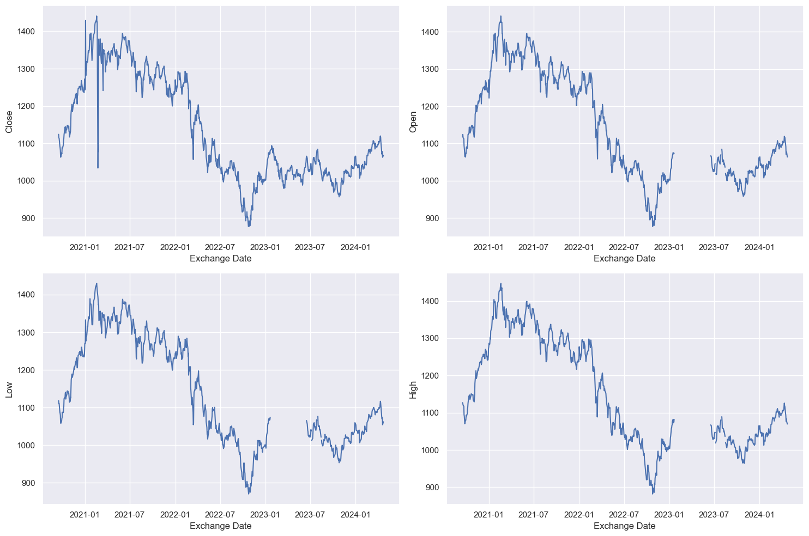
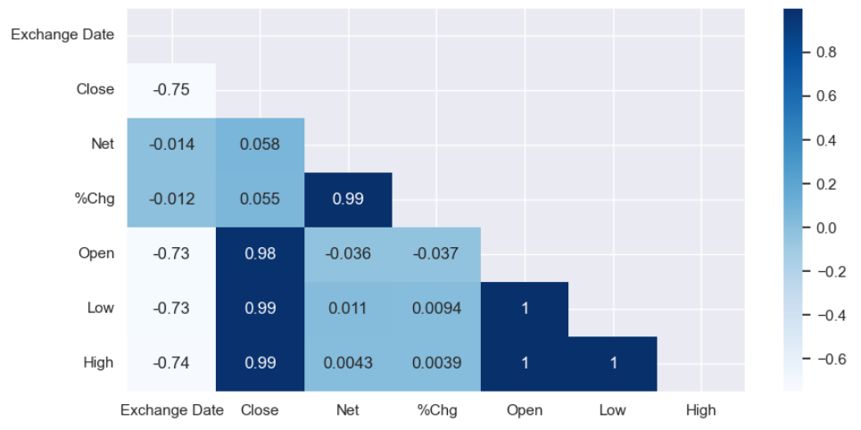
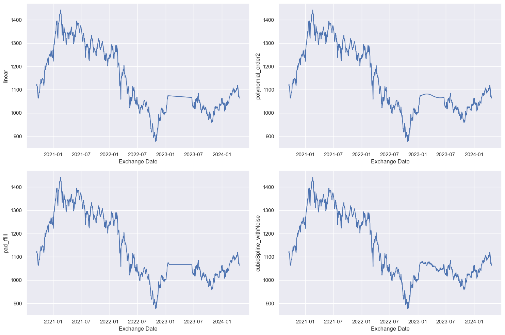
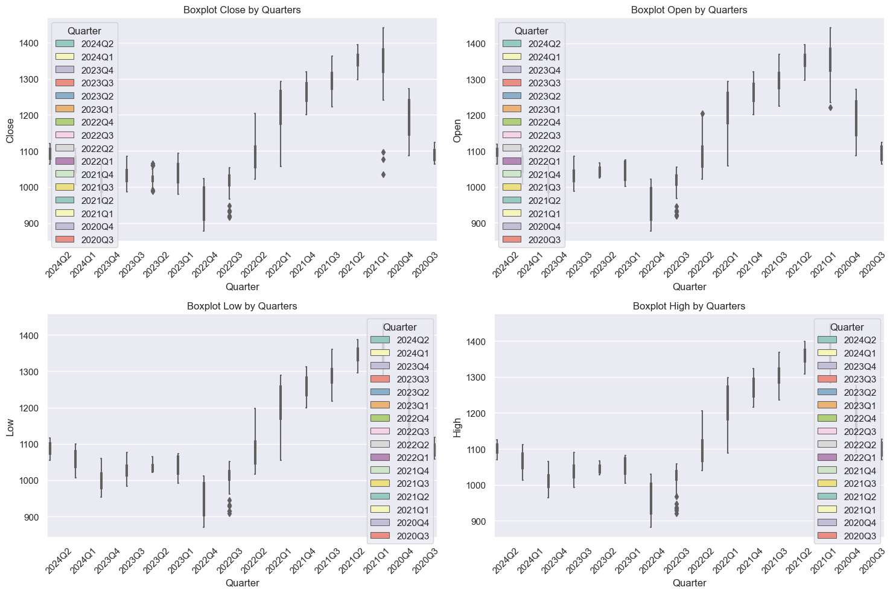

# Discover the world of Quant
LSEG Challenge - ESGEM.FGI Price Prediction

> [!NOTE] 
> For a comprehensive understanding, see our detailed documentation available [here](https://github.com/corfesh/LSEG-Quant-Challenge/blob/main/LSEG%20Challenge%20Report.pdf). This overview serves as a starting point.

## Exploratory Data Analysis

### **Time series line plot**

Shows the close, open, low and high prices over time. We can see right away that there is a sudden drop in close price in 2021-02, but comparing the plots side by side, it is clear that the low value those days was actually higher, implying that there were some errors. We can also notice missing data in the 'Open', 'Low', and 'High' columns.



### Correlation Heatmap

Shows correlation between different columns in the data. By visualizing the correlation, we can see which columns are highly correlated and which columns are not. This information can help us understand the relationship between different columns and how they affect each other.



## Challenges Regarding Data

### Missing Data

During our data exploration, we identified 107 continuous missing values in the 'Open' column. Failing to address these gaps could significantly undermine our modeling efforts. Initially, we sought to source this data from online platforms like Google Finance, but encountered limitations with data availability, especially for recent periods.

Traditional methods yielded insufficient data granularity, with only weekly data points available for periods like one or five years. To address this, we experimented with various interpolation techniques including linear, polynomial, and pad interpolation. Ultimately, employing a cubic spline interpolation with added noise proved most effective, providing a natural-looking data reconstruction.

Refer to the table below for a summary of each interpolation method and its respective results.



### Public Holiday

Since we have to deal with stock market data, it means that during the weekend or public holidays the market will be closed. We noticed that some days like 1 January are present in the dataset, with all the values, but we didn’t know if we have to ignore them or if it’s normal to have data on closed market as well. 

Another concern was that the public holidays differ between US and Europe, and we didn’t know what market we should address. In the end, we decided to keep those days since they didn’t represent any noise/outlier in our dataset.

### Outliers

We began our outlier detection process with visual analysis, using boxplots to visualize outlier distributions. Initially, we examined outliers by year for each column, but found the results inconclusive. We then refined our approach, plotting Close, Open, High, and Low values by quarters, which provided a more relevant perspective on stock market trends.

To further investigate, we explored four common outlier detection techniques: Interquartile Range (IQR), Local Outlier Factor (LOF), Median Absolute Deviation (MAD), and Isolation Forest.



## Data Cleaning

### Similar Rows

To address the issue of rows sharing multiple common columns, we devised a method similar to computing Hamming or Levenshtein distances. We constructed a square difference matrix, sized number_of_rows * number_of_rows, where ```difference_matrix[i][j]``` indicates the number of common columns between rows with indices i and j.

This approach led to an intriguing revelation: one row exhibited six common columns with another, differing only in the exchange date — Friday for one and sequentially Saturday for the other. Similar findings emerged with other rows, showing 3 or 2 commonalities, prompting corresponding adjustments.

Refer to the table below for an example of two similar rows sharing 6 common columns.

| Exchange Date | Close  | Net   | %Chg   | Open   | Low    | High   |
|---------------|--------|-------|--------|--------|--------|--------|
| 2023-01-02    | 1001.45| -0.2  | -0.0002| 1002.88| 1000.17| 1003.67|
| 2023-01-01    | 1001.45| -0.2  | -0.0002| 1002.88| 1000.17| 1003.67|

### Weekend Days 

Since we work with stock market data, we need to check if there are some issues in the dataset and it contains weekend data too. There were 3 weekend days found: 2022-01-01, 2021-01-03, 2021-01-02. We dropped their corresponding rows from the dataframe.

### Missing Days

To detect missing days, we devised a simple method: iterating through every 5 datapoints and verifying if the start and end points correspond to Monday and Friday, respectively. Through this process, we identified 3 missing days: 2024-04-15, 2024-03-15, and 2024-02-15.

### Resolve Obvious Outliers

As we observed in the EDA section, there was a sudden drop in the ‘Close’ values in 2021, and by printing all the values for those lines, we observed that only the ‘Close’ had wrong values, by being out of range of [low, high]. 

The ‘Net’ value for those lines seemed correct. In this way, we fixed the ‘Close’ values by summing the ‘Net’ value to the ‘Close’ price from the previous day, starting with the day with the correct value for ‘Close’ (2021-02-19).

### Wrong Net Values

We also have taken a look at Net values, thinking they could be wrongly calculated. After fixing the close values first, we went through the whole data and checked to see if there are some errors. And we actually found some, some Net values were not corresponding with the close values provided, we analysed more and saw that the net values were in fact the problem. We fixed this issue by calculating the correct values and replacing them in the data.

Similarly, the %Chg column also had errors, but we decided to ignore them since we dropped the column completely, being 100% correlated to the Net column.

## Implemented Models

### 1. ARIMA

- **Split**

As we don’t have a designed dataset for validation, we will use a portion of the training dataset as validation samples. A common way to set the ratio between train and validation is using ‘random_state 42’, which allocates 80% of the dataset to training, and the rest of 20% for validation. 

In order to prevent multiple cycles of economics and past events, which can affect the market through seasonal trends, we decided to focus on the dataset starting from 2023. After obtaining a RMSE score of ~7.55 on the splitted data, we moved to test it for our targeted five days. 

Five variations were tested at this point: for training data: 15, 20, 29, respectively 45 days in order to have multiple variations starting with 75% to 90% for the training set. We then tested it on the entire temporary dataset (356 days). These variations were made to help assess the robustness of the model.

- **Features**

Trained and predicted only the ‘Close’ column. Even though it doesn’t  
capture all the relevant information for accurate predictions, it seemed to be more resilient. Tried to use the ‘Open’ value too, but it obtained a worse score

- **Model**

***ARIMA*** (Autoregressive Integrated Moving Average) is suitable for single
time series data, since the model is univariate, in general. The abbreviation of the model comes from combining “AR”, “I” and “MA”, which comes from:

**Autoregression:** it predicts future values based on a linear combination of past values

**Integrated:** removes trends or seasonality and the statistical properties of a time series doesn’t change over time

**Moving Average:** it helps capture short-term fluctuations or random noise

In the beginning, we fit the model without taking in consideration seasonal trends and 	we perform hyperparameter tuning on  all variations of ‘p’ , ‘d’, ‘q’ parameters from
orders.

### 2. XGBoost

- **Split**

The dataset was split into multiple training sets (x_train_ndays) and corresponding target sets (y_train_ndays), with different window sizes (15, 20, 30, 45, 60, 75, 90 days) to train and evaluate the model.

The primary goal is to predict stock prices for the next 5 days. Given the short-term nature of the prediction horizon, training the model on longer historical windows (e.g., 4 years) might introduce unnecessary noise and irrelevant/non-representative of current market behavior patterns and outdated trends that do not impact the short-term price movements. 

By using shorter training windows (e.g., 15, 20, 30 days), the model can focus on capturing recent trends and patterns that are more likely to influence prices in the immediate future.

Another thing taken into consideration is that the dataset might contain unusual events (such as the significant drop in 2022) that could disproportionately influence the model's learning if included in longer training windows.


- **Features**

Several technical indicators and moving averages were calculated. 

**Exponential Moving Average (EMA)** - an average where greater weights are applied to recent prices - calculated with a window of 9 days.

**Simple Moving Averages (SMA)** with windows of 5, 10, 15, and 30 days.

**Relative Strength Index (RSI)** with a default window of 14 days, calculated using the change in closing prices. It indicates the magnitude of recent price changes and it can show that a stock is either overbought or oversold.

**Moving Average Convergence Divergence (MACD)** which shows the relationship between 2 exponential moving averages  and its signal line - calculated based on the 12-days and 26-days EMAs of closing prices.

Moving averages help smooth out stock prices on a chart by filtering out short-term price fluctuations.

- **Model**

***XGBoost (eXtreme Gradient Boosting)*** regression was selected for its ability to capture complex relationships in the data and handle nonlinear patterns.
GridSearchCV was employed to optimize the hyperparameters of the XGBoost regressor, including n_estimators, learning_rate, max_depth, and gamma.


### 3. LSTM

- **Split**

We integrated the Train-Test Split for Cross-Validation. 80% of the data was used to train the model, and the additional 20% were left to test the model performance and accuracy.

- **Features**

In this model, we chose to predict the difference between the current close value and the next one (meaning that we predicted the Net value instead of Close). It proved to be more reliable and to not overfit as easily.

The feature chosen to work on this model where: Close and Net. We eliminated other features, as it confused the model and they were not as consistent. We also added new features like: ***RSI*** (Relative Index Strength), ***EMAF*** (Exponential Moving Average Forecasting), ***MACD*** (Moving average convergence/divergence Line) and ***MACDs*** (Moving average convergence/divergence Signal Line)

- **Model**

***LSTM’s*** or Long Short-Term Memory models are a type of neural network that can learn long-term relationships between the selected data, useful for predicting stock prices.

They examine a sequence of data over time and predict future data, considering what they have learned so far.

LSTM’s are known for being very successful in predicting next number in a sequence, predicting stock prices and where even used for natural language processing.
Why? Because this is where they shine, they can capture dependencies over time, but as the time progresses, older data becomes less relevant and doesn’t impact the result as much.

**Lookback period:** For this model we have decided to use a lookback period approximately 1 year (start of 2023 - until the end). This choice was made regarding our data analysis done beforehand, as we have seen that in 2022, because of other events, the price took a huge dip. 

This phenomenon is not expected to happen in the next 5 days, which means that training the model on that time period will only make it more inaccurate. 

**Preparing the data:** The training data was meticulously structured to optimize the model's performance. Each training vector consists of 28 curated sets of values, including metrics such as close value, net value, RSI, EMAF, MACD and MACDS. 

The values within each vector were scaled to conform to the [0,1] range, a critical step in enhancing the model's comprehension and performance. By standardizing the data in this manner, the model can more effectively discern patterns and relationships, ultimately leading to more accurate predictions and analyses.

**Hyperparameter Tuning:** For this model we went with 1 input layer with the same size as the train vector, 2 hidden layers: The sizes of these layers were carefully tested to best fit the data we have and improve the model’s performance. Other choices, like choosing more hidden layers or making them more complex, proved to be more prone to overfitting and not generalizing well for unseen data. 

The tanh activation function was deemed to be the most accurate, other tests like: sigmoid, relu, leaky_relu and linear didn’t perform as good.

Other parameters like batch_size and epochs were left close to the default values, seeing as changing them would negatively affect our model.
